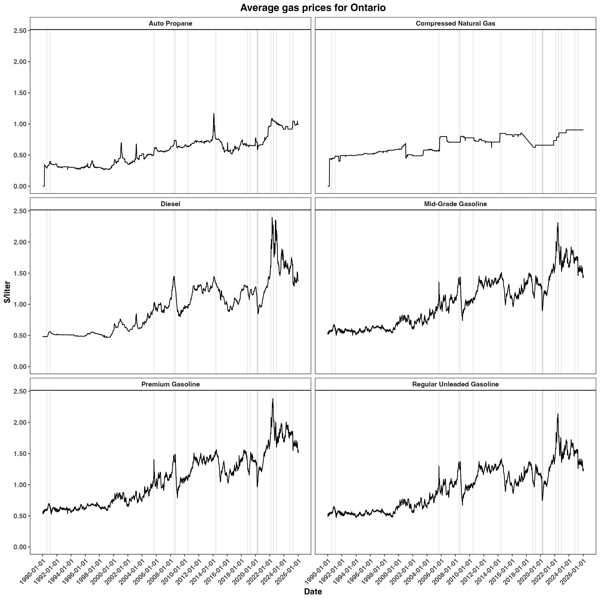
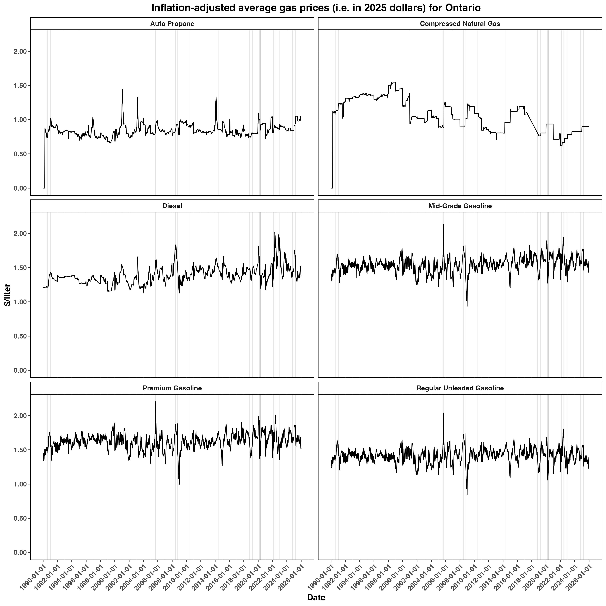
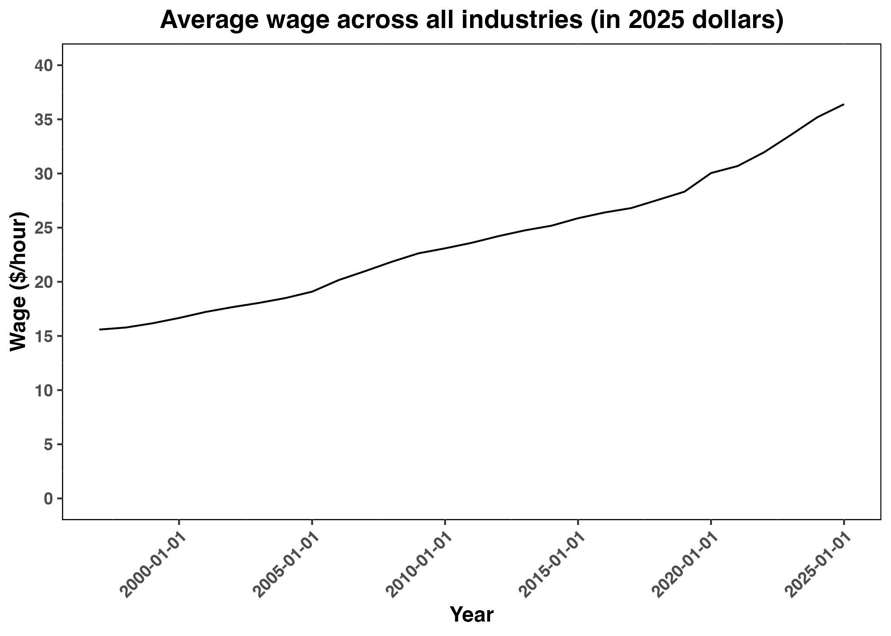
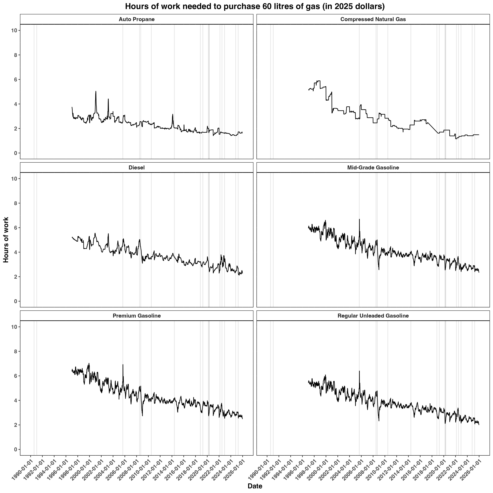

The illustration below shows how gas prices in Ontario, Canada changed from 1990 to today. It is easy to see that the prices have climbed over the years. However, prices are not adjusted for inflation. Thus, it is possible that the increase in gas prices may have been due to increase in prices for all products, across the board. See next figure for an inflation-adjusted version.

Below is a graph of Ontario gas prices with adjustment for inflation. Specifically, these prices are in 2025 dollars. It looks like prices overall remained steady with some fluctuations occurring throughout. One interpretation of inflation-adjusted is that although the dollar number associated with gas did increase over time (previous graph), it didn't change much with respect to other products. That does not mean the pressures were not felt. This analysis has not yet explored how gas prices changed with respect to wages.

To get a better understanding how gas prices changed with respect to wages, the next figure will show how wages (in 2025 dollars), on average, progressed over time.

The figure below shows how many hours of work is needed to buy 60 litres (average tank volume, approximately) of gas. It appears that the hours of work needed tends to trend downward over the years. This does not take into account the cost of other goods and needs (e.g. rent) or how wages behaved within each industry.

